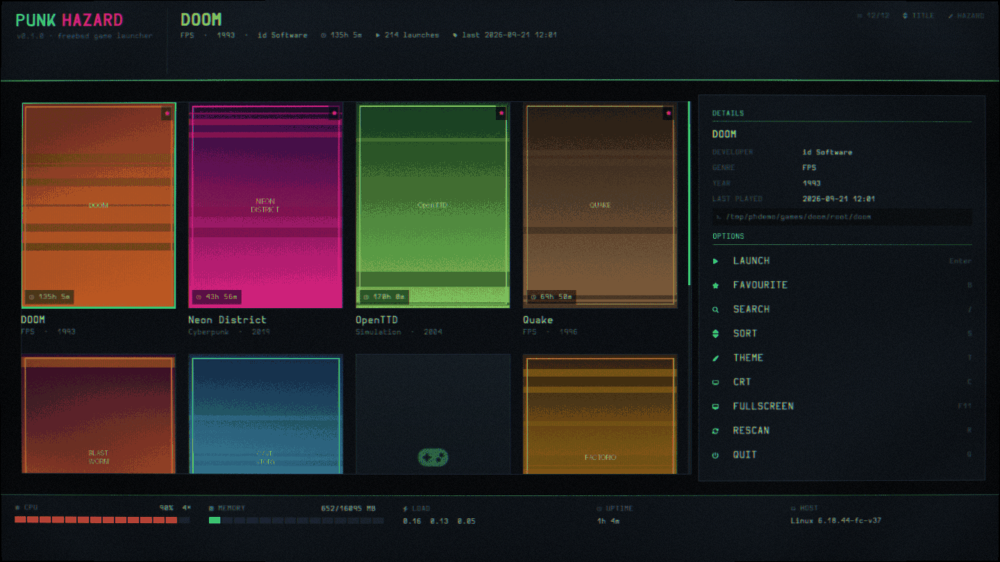
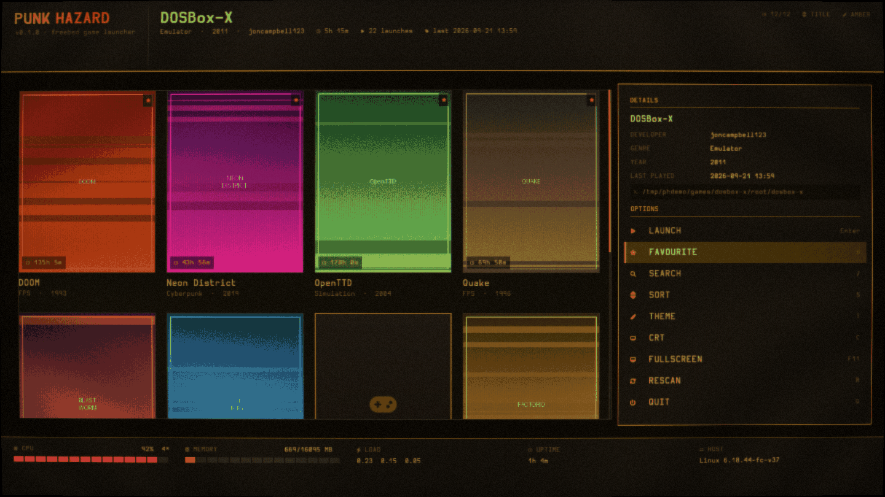
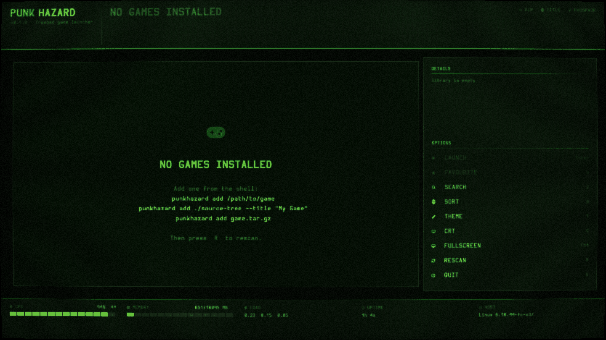

# punkhazard

A retro, console-style game launcher for **FreeBSD**, written in **C11 and Lua 5.4**.

You point it at a binary, a directory, a source tree or an archive. It installs
the game into a plain-text library and gives you a full-screen front end: a
box-art grid, a details-and-options panel, and a live system monitor — driven
by keyboard, mouse or gamepad, on **X11 or Wayland**.



```
+------------------------------------------------------------+
|  PUNK HAZARD   |  selected game, in detail        counts    |  top panel
+-------------------------------------+----------------------+
|                                     |  DETAILS             |
|   box-art grid                      |  cover meta desc     |
|   (70% of the width)                |  ------------------  |
|   reflows to fit the window         |  OPTIONS             |
|                                     |  (30% of the width)  |
+-------------------------------------+----------------------+
|  cpu    memory    load    uptime    host                   |  bottom panel
+------------------------------------------------------------+
```

Every dependency is permissively licensed. There is no GPL anywhere in the
tree.

---

## Table of contents

- [What it is, and what it is not](#what-it-is-and-what-it-is-not)
- [Requirements](#requirements)
- [Build and install](#build-and-install)
- [Quick start](#quick-start)
- [The launcher](#the-launcher)
- [The command line](#the-command-line)
- [How a library is stored](#how-a-library-is-stored)
- [Customising it: the Lua layer](#customising-it-the-lua-layer)
- [Architecture, deconstructed](#architecture-deconstructed)
- [Dependencies and licences](#dependencies-and-licences)
- [About the typeface licence](#about-the-typeface-licence)
- [Testing without a display](#testing-without-a-display)
- [Known limitations](#known-limitations)
- [Sources](#sources)

---

## What it is, and what it is not

**It is** a front end. Its job is to find your games, show them nicely, launch
one, get out of the way, and record how long you played. It is the parent
process of the game: when the game exits, control comes back.

**It is not** a store, a package manager, a DRM client, an emulator, or a
compatibility layer. It does not phone home, it has no account, and it makes no
network connections whatsoever — there is not a single socket call in the
source tree.

The library on disk is plain text and ordinary directories. `grep(1)` finds a
game, `ed(1)` fixes a typo, `tar(1)` backs the whole thing up. If you delete
punkhazard tomorrow, your games and their metadata are still sitting there in a
readable form.

---

## Requirements

FreeBSD, plus four packages:

```sh
pkg install sdl2 lua54 mesa-libs mesa-dri
```

| Package | Why |
| --- | --- |
| `sdl2` | window, input, fullscreen, gamepad |
| `lua54` | themes, layout, keymap, build recipes |
| `mesa-libs` | EGL and OpenGL ES 2.0 headers/libraries |
| `mesa-dri` | the actual GPU driver at runtime |

A C11 compiler (base `clang` is fine) and `pkg-config`.

For Wayland you also want your compositor's usual stack; SDL finds it. Nothing
needs to be rebuilt to switch between X11 and Wayland — the same binary does
both, chosen at runtime.

It builds and runs on Linux too (that is how it is developed), but FreeBSD is
the target and the only platform the defaults are tuned for.

---

## Build and install

```sh
./configure
make
make install          # default prefix /usr/local
```

`./configure` is a hand-written POSIX `sh` script, not autoconf. It probes for
your compiler, for SDL2/EGL/GLESv2, and for whatever Lua's `pkg-config` module
happens to be called on your system — FreeBSD's `lang/lua54` installs
`lua-5.4.pc`, Debian installs `lua5.4.pc`, others ship `lua54.pc`, and there is
no single correct name to hard-code.

Options:

```
--prefix=DIR      install prefix (default /usr/local, per hier(7))
--with-lua=NAME   force the pkg-config module name for Lua
--debug           -O0 -g3, assertions on
```

`make` works with FreeBSD's `make(1)` (bmake) and with GNU make unmodified. See
[the build system](#5-the-build-system-configure-plus-a-portable-makefile) for
how that is arranged.

---

## Quick start

```sh
# a prebuilt binary
punkhazard add ~/games/quake/quake --title "Quake" --genre FPS --year 1996

# a directory of files
punkhazard add ~/games/doom --title "DOOM"

# an archive: extracted, then treated as a directory
punkhazard add ~/downloads/cave-story.tar.gz

# a source tree: detected, built with a recipe, then scanned for the binary
punkhazard add ~/src/openttd --title "OpenTTD"

# something already installed elsewhere -- register it in place, copy nothing
punkhazard add /usr/local/bin/nethack --link --title "NetHack"

# then just:
punkhazard
```

Box art is any `cover.png` / `cover.jpg` dropped into the game's directory, or
`--cover file.png` at import time.

---

## The launcher

Four regions, all driven from the current selection:

- **Top panel** — the wordmark, then the highlighted game in more detail than
  its tile can show: title, genre, year, developer, total playtime, launch
  count and when it was last played. On the right, the visible/total count,
  the sort key and the theme.
- **Grid (70%)** — box art, one tile per game. The column count is *derived
  from the window width*, not fixed, so the grid reflows on resize instead of
  clipping. A tile carries a playtime badge, a favourite star, and the title
  and genre/year beneath. Games with no cover get their Nerd Font icon.
- **Panel (30%)** — `DETAILS` for the highlighted game (metadata, description,
  and the exact path that will be executed) above an `OPTIONS` list. `Tab`
  moves focus between the grid and the options; the options are also clickable,
  and each shows its keyboard shortcut, so the panel doubles as a reminder.
- **Bottom panel** — CPU, memory, load average, uptime and host, read straight
  from the kernel. See [the system monitor](#8-the-system-monitor).

Below 960px wide the panel is dropped and the grid takes the whole width; the
top panel still carries the selected game's details.

### Keyboard

| Key | Action |
| --- | --- |
| arrows / `h` `j` `k` `l` | move around the grid |
| `Tab` | move focus: grid ⇄ options panel |
| `PageUp` `PageDown` | move a screenful |
| `Home` `End` | first / last entry |
| `Return` `Space` | launch (or activate the highlighted option) |
| `/` | filter the library |
| `B` or `*` | toggle favourite (favourites always sort first) |
| `S` | cycle sort: title, recent, playtime, added, year |
| `R` | rescan the library from disk |
| `T` | cycle theme |
| `C` | toggle the CRT post-process |
| `F11` or `F` | toggle fullscreen |
| `F1` or `?` | key help |
| `Esc` | close overlay / clear filter |
| `Q` | quit |

### Mouse

Wheel scrolls the grid, hover highlights a tile or an option row, click
selects, double-click launches. Clicking an option row runs it.

### Gamepad

D-pad or left stick moves (with autorepeat), `A` launches, `B` backs out, `X`
moves focus to the options panel, `Y` favourites, shoulders page, `Back`
cycles sort. Hotplug works.

SDL's game-controller database maps whatever the kernel exposes onto standard
button names, so the bindings in `keys.lua` talk about `a` and `dpup` rather
than "button 3 on this particular pad". On FreeBSD the devices underneath are
evdev nodes from the `hid`/`evdev` drivers; SDL opens them, so punkhazard does
not have to.

Every one of these bindings lives in `lua/keys.lua` and can be changed without
recompiling.

---

## The command line

The GUI is one front end, not the only one. Everything is reachable from the
shell, output is tab-separated, and exit status means what it always means.

```
punkhazard                       run the graphical launcher
punkhazard add <path> [options]  import a game
punkhazard ls                    list the library, tab-separated
punkhazard info <slug>           print one game's manifest
punkhazard run <slug>            launch without the GUI
punkhazard rm <slug>             remove a game and its files
punkhazard paths                 print the directories in use
punkhazard version | help
```

`add` options: `--title --exec --args --genre --developer --year --desc
--cover --no-build --link`.

Because `ls` is tab-separated it composes:

```sh
# the five games you have sunk the most launches into
punkhazard ls | sort -t"$(printf '\t')" -k6 -rn | head -5 | cut -f2

# everything you have never actually played
punkhazard ls | awk -F'\t' '$5 == "never" { print $2 }'
```

`run` passes the game's own exit status straight through, so
`punkhazard run x && echo ok` behaves the way it reads.

---

## How a library is stored

```
$PUNKHAZARD_ROOT/                 default ~/.local/share/punkhazard
├── config.lua                    your overrides, optional
└── games/
    └── doom/
        ├── manifest              the record below
        ├── cover.png             box art, optional
        ├── install.log           transcript of the build/install
        └── root/                 the game's own files
```

The root is chosen in order of decreasing explicitness: `PUNKHAZARD_ROOT`, then
`$XDG_DATA_HOME/punkhazard`, then `~/.local/share/punkhazard`.

A manifest is `key = value`, one per line, `#` for comments:

```
title = DOOM
genre = FPS
developer = id Software
year = 1993
exec = doom
workdir = .
desc = Rip and tear through the UAC facility on Phobos.
added = 1758700000
last_played = 1789992082
play_count = 214
play_seconds = 486300
favorite = 1
```

`exec` and `workdir` are relative to `root/` unless they start with `/`. A
newline inside a value is written as `\n` so that one record is always one
line — that is what keeps the file greppable. Unknown keys are ignored rather
than rejected, so a newer punkhazard writing extra fields does not break an
older one reading them.

Manifests are written to a temporary file and `rename(2)`d over the target.
`rename` is atomic within a filesystem, so a crash mid-write leaves the
previous manifest intact rather than a truncated one. Play statistics are
written after every session, so this path runs often enough for that to matter.

---

## Customising it: the Lua layer

C owns *mechanism*: pixels, processes, files, the event loop. Lua owns
*policy*: which colours, which metrics, which key does what, which command
builds a source tree.

Five files, each a plain chunk returning a table, read once at startup and
converted into C structs. **A frame never enters the Lua VM** — there is no
per-frame scripting cost, and nothing in Lua can stall the renderer.

| File | Controls |
| --- | --- |
| `config.lua` | window size, fullscreen, vsync, CRT on/off, theme name |
| `theme.lua` | named colour schemes and per-effect CRT strengths |
| `layout.lua` | panel heights, the 70/30 split, tile size, font sizes |
| `keys.lua` | keyboard and gamepad bindings |
| `install.lua` | build recipes for imported source trees |

Do not edit the shipped files. Put overrides in `$PUNKHAZARD_ROOT/config.lua`,
which is loaded afterwards and merged over the shipped config, so you only
state what you want changed:

```lua
return { theme = "amber", crt = false, fullscreen = true }
```

### Themes

Five ship: `hazard` (toxic green and hazard magenta), `amber` (a DEC VT220),
`phosphor` (P1 green, monochrome and heavy), `ice` (cold and flat), `blood`
(magenta and orange).

Amber, with the options panel focused:



Phosphor, on a first run with nothing installed yet:



Colours are `0xRRGGBBAA` integers. Lua 5.4 has real 64-bit integers, so
`0x1affaaff` keeps every bit — under 5.1/5.2 it would have arrived as a double
and lost the low byte.

Six floats per theme drive the CRT fragment shader: `scanline`, `curvature`,
`vignette`, `aberration`, `glow`, `noise`. All are `0` for off, so a theme can
be a heavily curved arcade monitor or completely flat.

### Build recipes

`install.lua` is an ordered list. When a directory is imported, the first
recipe whose `detect` list names a file that exists at the top of the tree
wins, and its `steps` are run there:

```lua
{
    name   = "cmake",
    detect = { "CMakeLists.txt" },
    steps  = {
        { "cmake", "-S", ".", "-B", "build", "-DCMAKE_BUILD_TYPE=Release" },
        { "cmake", "--build", "build", "--parallel" },
    },
},
```

Each step is an **argv array, not a command string**, because there is no shell
involved — see below. Shipped recipes cover autotools, CMake, meson, bmake,
GNU make, cargo and go. Return `{}` to disable building entirely.

---

## Architecture, deconstructed

```
                 main.c ── CLI dispatch
                    │
                    ├── app.c ──── SDL window, GL context, main loop
                    │     │
                    │     ├── input.c ─ SDL events → enum ph_action
                    │     └── ui.c ──── immediate-mode library/details/overlays
                    │            │
                    │            ├── text.c ─ stb_truetype → GL glyph atlas
                    │            └── gfx.c ── GLES2 batcher + CRT post-process
                    │
                    ├── sysmon.c ── sysctl(3) → the bottom panel
                    ├── catalog.c ─ manifests, scan, sort, filter
                    ├── install.c ─ import pipeline
                    ├── launch.c ── fork/exec + playtime accounting
                    ├── script.c ── the Lua 5.4 bridge
                    └── util.c ──── paths, fs, processes, UTF-8
```

### 1. The rendering path: SDL2, but an OpenGL **ES** context

SDL2 already contains tested X11 and Wayland video backends, fullscreen
handling and the controller database. Writing raw Xlib and raw
`libwayland-client` backends would mean owning two of everything — including
two fullscreen paths and two input paths — for a launcher whose job is to get
out of the way and run a game.

The context requested is **OpenGL ES 2.0, not desktop GL**, and that is the
deliberate part. It is what makes the two display servers converge on one code
path:

- Wayland has no GLX at all. EGL is the only option there.
- On X11, SDL defaults to GLX. `SDL_hints.h` documents
  `SDL_HINT_VIDEO_X11_FORCE_EGL` with the note *"By default SDL will use GLX
  when both are present."*

Setting that hint and asking for an ES profile puts X11 and Wayland on the same
EGL + GLES 2.0 path. The alternative is one path that gets tested and one that
gets hoped for.

Inside `gfx.c`: one shader, one vertex format, one dynamic VBO. Solid
rectangles are drawn with a 1×1 white texture rather than a second shader, so
the batcher only ever breaks on a genuine texture change, a clip change, or a
full buffer. The UI renders into an offscreen framebuffer and is resolved with
a single fullscreen triangle — through the CRT shader when it is enabled,
through a pass-through blit when it is not. The UI code never knows which.

**`gfx.c` contains no reference to SDL.** That is what makes
[headless testing](#testing-without-a-display) possible.

### 2. The text path: the typeface is *inside the binary*

`tools/bin2c` turns `HurmitNerdFontMono-Regular.otf` and `-Bold.otf` into C
arrays at build time, so the typeface lives in `.rodata`. There is no
fontconfig lookup, no font path to guess, and no failure mode where the UI
comes up blank because a file moved. It costs about 4.4 MB of the binary and
one ~5-second compile that only reruns when the font changes.

C has no portable way to include a binary file — C23's `#embed` is too new to
rely on and `ld -b binary` is linker-specific — so the array is generated. It
is the oldest trick in the book and it is 60 lines with no dependencies.

Glyphs are rasterised **on demand**, not pre-baked: a Nerd Font carries on the
order of ten thousand glyphs across the Latin ranges and the Private Use Area
icon blocks, and baking all of them at three sizes on startup would cost time
and atlas space for icons the UI never draws. Each code point is rasterised the
first time it is asked for, packed into a GL atlas with a shelf packer, and
cached in an open-addressed hash table.

Every icon code point used by the UI was checked against the actual baked face
with `stbtt_FindGlyphIndex` before being used. That check is why the footer
uses Font Awesome arrows (`U+F062`, `U+F063`) rather than the obvious Unicode
ones: **`U+2191`, `U+2193` and `U+23CE` are not in Hurmit** and rendered as
blanks.

### 3. The process model: `fork(2)` + `execvp(3)`, never `system(3)`

Nothing in this program goes through a shell. Not launching a game, not
extracting an archive, not running a build step.

`system(3)` and `popen(3)` hand a string to `/bin/sh`, which would make every
game title, path and argument into shell syntax. Here the `argv` array crosses
into the new image untouched, so a directory called `; rm -rf ~` is just an
awkward directory name.

`fork(2)` documents the contract the launcher relies on: *"Upon successful
completion, fork() and _Fork() return a value of 0 to the child process and
return the process ID of the child process to the parent process."* The child
exits with `_exit(2)` rather than `exit(3)`, because `exit(3)` would run
`atexit` handlers and flush stdio buffers the child inherited from us,
duplicating output the parent has not written yet.

Playtime is measured on **`CLOCK_MONOTONIC`**, not `time(2)`. The monotonic
clock is unaffected by an administrator setting the clock or by NTP stepping
it; wall-clock time would let an adjustment during a long session record a
negative or wildly inflated playtime. The wall clock is still the right source
for "when did I last play this", which is a date, so `last_played` uses
`time(2)` and only the duration uses the monotonic clock. A session under five
seconds counts as a launch but adds no playtime, so a broken `exec` line does
not silently accumulate hours.

### 4. Strings and paths

`strlcpy(3)` and `strlcat(3)` are used throughout rather than `strncpy(3)`.
They are BSD-native: on FreeBSD they are in libc, declared by `<string.h>`.
They *"take the full size of the destination buffer and guarantee
NUL-termination if there is room"*, and they return the length they *wanted* to
write — which is exactly the truncation check needed. Every path join checks
for truncation and treats it as an error, never as a silently shortened path,
because acting on half a path can delete or overwrite the wrong thing.

This is also why `ph.h` deliberately defines **no** feature-test macro on
FreeBSD: `<sys/cdefs.h>` defaults `__BSD_VISIBLE` to 1, which is what exposes
these functions. Defining `_POSIX_C_SOURCE` would *hide* them.

`realpath(3)` is called with a `NULL` buffer, not one of ours. The man page is
explicit: *"The resolved_path argument **must** point to a buffer capable of
storing at least PATH_MAX characters, or be NULL."* `PH_PATH_MAX` is this
program's own bound (1024) and is **not** `PATH_MAX` (4096 on Linux), so
passing one of our buffers is a real overflow. Passing `NULL` makes realpath
allocate exactly what it needs — the result *"must be freed by the caller"* —
and sidesteps `PATH_MAX` differing per platform. *(This was a live bug during
development, caught by glibc's `_FORTIFY_SOURCE`.)*

Removing a game re-slugs its name before touching the filesystem. `ph_slug()`
cannot produce `..`, a `/`, or an empty string, so there is no input to
`punkhazard rm` that can delete something outside `games/`.

### 5. The build system: `configure` plus a portable Makefile

FreeBSD's `make(1)` is bmake and spells file inclusion `.include "file"`. GNU
make spells it `include file` and rejects bmake's form. There is no spelling
both accept in all versions.

Rather than fight that, `./configure` substitutes its probe results directly
into `Makefile`, and the generated makefile uses only syntax both dialects
agree on: plain assignment, `$(VAR)` expansion, suffix rules (`.c.o`) instead
of GNU `%` patterns, `$<`/`$@` only inside inference rules, and no `$(shell)`
or `!=` anywhere. All probing happened in the shell script, where probing
belongs.

`/usr/local` is the default prefix because that is what `hier(7)` says it is
for: *"local executables, libraries, etc, installed by pkg(7) or ports(7)"*.

### 6. Archives

Extraction shells out to `tar(1)`, which on FreeBSD is **bsdtar**:
`usr.bin/tar/Makefile` in the FreeBSD source tree reads `PROG= bsdtar` and
`SYMLINKS= bsdtar ${BINDIR}/tar`, and it is built from libarchive. That means
FreeBSD's `tar` reads `.zip` as happily as `.tar.xz`. GNU tar does not, so on
other systems there is an `unzip` fallback. Reimplementing tar in C would be
conceptual bloat; calling the right tool is the UNIX answer.

If the extracted tree is a single directory — the polite tarball shape — the
importer descends into it, so the library does not end up with
`root/foo-1.2.3/foo-1.2.3/bin/foo`.

### 7. Finding the entry point

After a copy or a build there is a tree and a question: which file did the user
actually want to run? Real source trees disagree wildly about where the binary
lands, so instead of a fixed rule, candidates are **scored**: +120 for a name
matching the slug exactly, +55 for a partial match, +45 for living in `bin/`,
+15 for having no extension (a classic UNIX binary name), +10 for being over
64 KB (not a two-line wrapper), minus 6 per directory of depth. Objects,
libraries, headers and the usual autotools scaffolding (`configure`,
`config.status`, `libtool`, `install-sh`) are excluded outright.

It is a heuristic and it says so — `--exec` overrides it, and a failure prints
the path of the manifest to edit.

### 8. The system monitor

The bottom panel reads the kernel directly through `sysctl(3)`. No
libstatgrab, no libgtop, no parsing the output of `top(1)` — those are all
wrappers around the same handful of sysctls, and each would be a dependency, a
`fork(2)`, or both, sixty times a second. The kernel is sampled twice a second,
which is well past what anyone reads off a panel.

| Reading | Source |
| --- | --- |
| CPU | `kern.cp_time` |
| Memory | `vm.stats.vm.v_page_count`, `v_active_count`, `v_wire_count`, `v_laundry_count`, `hw.pagesize` |
| Load | `getloadavg(3)` |
| Uptime | `kern.boottime` |
| CPUs | `hw.ncpu` |
| Host | `uname(3)` |

Two details worth stating, because both are easy to get wrong:

**CPU is a difference, not a reading.** `kern.cp_time` is an array of
`CPUSTATES` longs holding *ticks since boot* in each state (user, nice, sys,
intr, idle), so a single read says nothing about current load. Utilisation is
the difference between two samples:

```
busy% = 100 × (1 − idle_delta / total_delta)
```

**"Used" memory excludes inactive pages.** Used is taken as
`active + wired + laundry`. Inactive pages are still reclaimable on demand, so
counting them as used would report a perfectly healthy FreeBSD box as
permanently full — which is the classic way of misreading this interface.

A Linux path exists for development builds and reads `/proc/stat`,
`/proc/meminfo` and `/proc/uptime`, which are the equivalent native interfaces
there. The two live in separate `#ifdef` blocks rather than behind a
pretend-portable abstraction, because they genuinely are different interfaces
with different semantics.

---

## Dependencies and licences

Every dependency is permissive. There is no GPL, LGPL or MPL anywhere.

| Component | Version | Licence | How it is used |
| --- | --- | --- | --- |
| SDL2 | 2.32.10 | **zlib** | window, input, fullscreen, gamepad |
| Lua | 5.4.8 | **MIT** | themes, layout, keys, build recipes |
| Mesa (EGL/GLESv2) | — | **MIT** | the GL implementation |
| stb_truetype.h | v1.26 | **MIT / public domain** | glyph rasterisation (vendored) |
| stb_image.h | v2.30 | **MIT / public domain** | cover art decoding (vendored) |
| stb_image_write.h | v1.16 | **MIT / public domain** | test harness only (vendored) |
| Hurmit Nerd Font Mono | 3.4.0 | **SIL OFL 1.1 (RFN)** | the typeface, baked in |
| punkhazard itself | 0.1.0 | **BSD 2-Clause** | — |

The SDL2, Lua and Mesa licence identifiers are taken from the FreeBSD ports
tree itself (`devel/sdl20/Makefile` → `LICENSE= ZLIB`, `lang/lua54/Makefile` →
`LICENSE= MIT`, `graphics/mesa-libs/Makefile` → `LICENSE= MIT`), not from
memory.

---

## About the typeface licence

This deserves stating plainly rather than burying in a table.

Hurmit is the Nerd Fonts patched build of **Hermit** by Pablo Caro, and the
Nerd Fonts catalogue records its licence as `"licenseId": "OFL-1.1-RFN"` — SIL
Open Font License 1.1 **with a Reserved Font Name**.

The OFL is not GPL-style copyleft, and it does **not** affect punkhazard's own
BSD-2-Clause licence. Clause 2 permits exactly what is done here:

> *"Original or Modified Versions of the Font Software may be bundled,
> redistributed and/or sold with any software, provided that each copy
> contains the above copyright notice and this license."*

Accordingly the unmodified font files and the full OFL text are shipped in
`third_party/fonts/`.

Two genuine constraints do come with it, and you should know them:

1. **Clause 5** — *"The Font Software, modified or unmodified, in part or in
   whole, must be distributed entirely under this license"*. That reciprocity
   binds the **font**, not the program. Clause 5 also says explicitly that it
   *"does not apply to any document created using the Font Software."*
2. **Clause 3** — the Reserved Font Name. A *modified* version of the font may
   not be called Hermit or Hurmit.

Because the font is embedded **unmodified** and rasterised at runtime, this is
clause-2 bundling, not a Modified Version. Had the build pre-rasterised the
font into a bitmap atlas and shipped that instead, the derivative-work question
would be live — which is one more reason the runtime rasteriser is the right
design.

If you would rather not ship an OFL font at all, drop any `.otf`/`.ttf` into
`third_party/fonts/`, point the two `bin2c` rules in `Makefile.in` at it, and
rebuild. Nothing else changes.

---

## Testing without a display

A renderer you cannot run is a renderer you cannot check. Because `gfx.c` has
no SDL dependency, the whole UI can be driven headlessly:

```sh
make shot
./tools/phshot -o shot.png -w 1600 -h 900 -t amber --select 4
./tools/phshot -o help.png --help-overlay
./tools/phshot -o find.png --search "doo" --no-crt
```

`phshot` creates an OpenGL ES 2.0 context on an EGL pbuffer
(`EGL_PLATFORM_SURFACELESS_MESA`, falling back to the default display), drives
the real `gfx`/`text`/`ui` code exactly as `app.c` does, and writes a PNG. It
needs no X server, no Wayland compositor and no GPU — Mesa's `llvmpipe` is
enough. It is not installed by `make install`.

This is not decoration. It is how the `mediump` shader bug described below was
found, and every screenshot in this README was produced by it.

> **A real bug it caught.** The CRT shader originally used the standard GLSL
> noise hash, `fract(sin(dot(p, vec2(12.9898, 78.233))) * 43758.5453)`, fed
> screen-pixel coordinates. GLSL ES 2.0 only *guarantees* `mediump` in fragment
> shaders, and a great deal of hardware implements `mediump` as a 16-bit float
> whose maximum finite value is **65504**. The dot product reaches the tens of
> thousands, overflows to infinity, `sin(inf)` is NaN, and the NaN propagates
> into the colour — so everything past the line `dot(p,k) == 65504` rendered
> black. That is a straight diagonal across the screen, and it is exactly what
> happened. The fix was a hash whose intermediates all stay under ~1000, plus a
> `GL_FRAGMENT_PRECISION_HIGH` preamble. This would have broken on Mali,
> Adreno and PowerVR, not just on llvmpipe.

---

## Known limitations

- **Cover art is trusted input.** `stb_image` parses whatever PNG/JPEG you put
  in your library directory. It is not a hardened decoder. The typeface is
  never a runtime input — stb_truetype's own header warns *"NO SECURITY
  GUARANTEE — DO NOT USE THIS ON UNTRUSTED FONT FILES"*, and the only font it
  ever sees is the one compiled into `.rodata`.
- **The entry-point scorer is a heuristic.** Use `--exec` when it guesses wrong.
- **No metadata scraping.** Titles, genres and descriptions are whatever you
  type or write into the manifest. Adding a scraper would mean adding a network
  stack; the manifest format is deliberately easy to generate from a script
  instead.
- **Text is Latin-script.** There is no bidi and no complex-script shaping;
  glyphs are laid out left to right with kerning.
- **One library at a time.** Switch with `PUNKHAZARD_ROOT`.
- **Tested on FreeBSD's toolchain expectations, developed on Linux.** The
  FreeBSD-specific claims in this document are cited from the FreeBSD source
  tree and ports tree rather than from a running FreeBSD box.

---

## Sources

Every factual claim above is from a primary source. Quotes are verbatim.

**FreeBSD source tree** (`github.com/freebsd/freebsd-src`, `main`):

- `lib/libc/string/strlcpy.3` — `LIBRARY: .Lb libc`; `.In string.h`;
  *"take the full size of the destination buffer and guarantee NUL-termination
  if there is room."*
- `lib/libc/stdlib/realpath.3` — *"The `resolved_path` argument **must** point
  to a buffer capable of storing at least `PATH_MAX` characters, or be
  `NULL`."*; *"a pointer to a null-terminated string which must be freed by the
  caller if it was."*
- `lib/libsys/fork.2`, RETURN VALUES — *"Upon successful completion, fork() and
  _Fork() return a value of 0 to the child process and return the process ID of
  the child process to the parent process."*
- `share/man/man7/hier.7`, entry `local/` — *"local executables, libraries,
  etc, installed by pkg(7) or ports(7)"*.
- `usr.bin/tar/Makefile` — `PROG= bsdtar`, `SYMLINKS= bsdtar ${BINDIR}/tar`,
  built from `lib/libarchive`.
- `sys/sys/resource.h` — `#define CPUSTATES 5`, `#define CP_IDLE 4`, the shape
  of the `kern.cp_time` array.
- `sys/kern/kern_clock.c` — `SYSCTL_PROC(_kern, OID_AUTO, cp_time,
  CTLTYPE_LONG|CTLFLAG_RD|CTLFLAG_MPSAFE, …, "CPU time statistics")`.
- `sys/vm/vm_meter.c` — the `_vm_stats_vm` node, i.e. `vm.stats.vm.*`:
  `VM_STATS_UINT(v_page_count, "Total number of pages in system")`,
  `VM_STATS_PROC(v_free_count, "Free pages", …)`,
  `VM_STATS_PROC(v_active_count, "Active pages", …)`,
  `VM_STATS_PROC(v_wire_count, "Wired pages", …)`,
  `VM_STATS_PROC(v_laundry_count, "Pages eligible for laundering", …)`.
- `sys/kern/kern_mib.c` — `SYSCTL_INT(_hw, HW_NCPU, ncpu, …, "Number of active
  CPUs")`, `SYSCTL_INT(_hw, HW_PAGESIZE, pagesize, …)`.

**FreeBSD ports tree** (`github.com/freebsd/freebsd-ports`, `main`):

- `devel/sdl20/Makefile` — `DISTVERSION= 2.32.10`, `LICENSE= ZLIB`.
- `lang/lua54/Makefile` — `DISTVERSION= 5.4.8`, `LICENSE= MIT`.
- `graphics/mesa-libs/Makefile` — `LICENSE= MIT`.

**SDL2** (`github.com/libsdl-org/SDL`, `SDL2`):

- `include/SDL_hints.h`, `SDL_HINT_VIDEO_X11_FORCE_EGL` — *"By default SDL will
  use GLX when both are present."*
- `src/events/SDL_keyboard.c`, `SDL_GetKeyName` — *"Unaccented letter keys on
  latin keyboards are normally labeled in upper case"*; the scancode name table
  gives the exact spellings `"Return"`, `"Escape"`, `"PageUp"`, `"PageDown"`,
  `"Up"`, `"Down"` used in `keys.lua`.
- `src/joystick/SDL_gamecontroller.c`, `map_StringForControllerButton[]` — the
  button names `"a"`, `"b"`, `"x"`, `"y"`, `"back"`, `"guide"`, `"start"`,
  `"leftshoulder"`, `"rightshoulder"`, `"dpup"`, `"dpdown"`, `"dpleft"`,
  `"dpright"`.

**stb** (`github.com/nothings/stb`, `master`):

- `stb_truetype.h` v1.26 header — *"NO SECURITY GUARANTEE — DO NOT USE THIS ON
  UNTRUSTED FONT FILES. This library does no range checking of the offsets
  found in the file, meaning an attacker can use it to read arbitrary memory."*
- `LICENSE` — dual MIT / public domain.

**Nerd Fonts** (`github.com/ryanoasis/nerd-fonts`, `master`):

- `bin/scripts/lib/fonts.json`, Hermit entry — `"unpatchedName": "Hermit"`,
  `"patchedName": "Hurmit"`, `"licenseId": "OFL-1.1-RFN"`,
  `"isMonospaced": true`.
- `patched-fonts/Hermit/LICENSE` — SIL OFL 1.1, *"with Reserved Font Name
  Hermit"*; clauses 2, 3 and 5 as quoted above. Shipped verbatim at
  `third_party/fonts/LICENSE.Hermit-OFL-1.1`.

**Lua** (`github.com/lua/lua`, `master`):

- `lua.h` copyright block — the MIT licence text, *"Copyright (C) 1994-2026
  Lua.org, PUC-Rio."*

**Khronos** — the `mediump` range limit (16-bit float, maximum finite value
65504) is the OpenGL ES Shading Language 1.00 minimum precision requirement;
the symptom and fix are documented in `src/gfx.c` at the `hash()` function.

---

## Licence

punkhazard is **BSD 2-Clause**. See [LICENSE](LICENSE).

Vendored third-party components keep their own licences, shipped alongside
them in `third_party/`.
